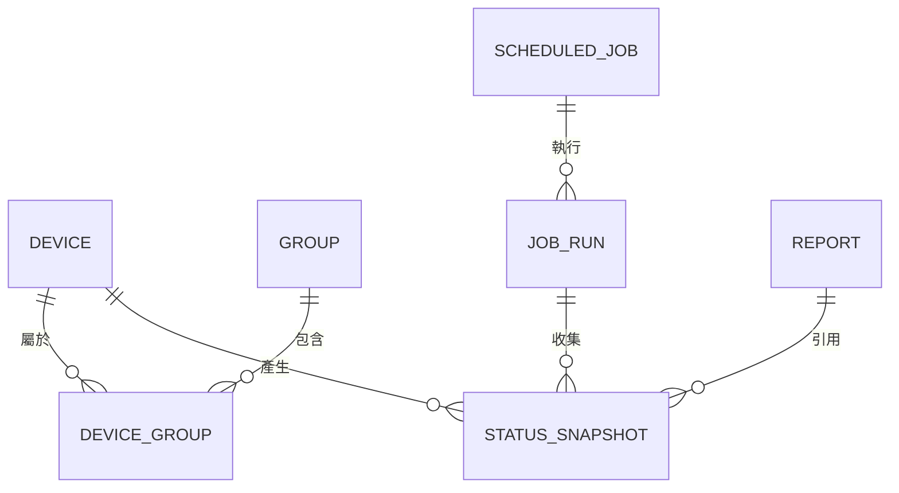

# Phase 1 資料模型：noc-lens

**功能**：[spec.md](./spec.md) ｜ **計畫**：[plan.md](./plan.md) ｜ **日期**：2026-06-24

本地以 SQLite 儲存。下列為領域實體、欄位、關聯與驗證規則（對應 spec 之 Key Entities 與 FR）。

---

## 實體關聯總覽



`DEVICE_GROUP` 為設備與群組的多對多關聯表（一台設備可屬多個群組／標籤）。

---

## Device（設備）

| 欄位 | 型別 | 說明 / 驗證 |
|------|------|-------------|
| id | TEXT (UUID) | 主鍵 |
| ip_address | TEXT | 必填；須為合法 IPv4/IPv6（FR-001） |
| username | TEXT | 必填 |
| password_enc | BLOB | AES-256-GCM 密文（含 nonce）；不得明文（FR-023/024） |
| note | TEXT | 備註，可空 |
| brand | TEXT (enum) | 必填；限 `cisco` / `aruba` / `fortigate_ngfw` / `palo_alto`（FR-005） |
| created_at | TEXT (ISO8601) | 建立時間 |
| updated_at | TEXT (ISO8601) | 更新時間 |

- **關聯**：多對多 → Group（透過 DeviceGroup）；一對多 → StatusSnapshot。
- **驗證**：ip_address 不可重複（匯入時重複需回報，見邊界情況）；brand 不在支援清單則拒絕。

## Group（群組／標籤）

| 欄位 | 型別 | 說明 / 驗證 |
|------|------|-------------|
| id | TEXT (UUID) | 主鍵 |
| name | TEXT | 必填、唯一（如「高雄三民區」「高雄高中」）（FR-003） |
| created_at | TEXT (ISO8601) | 建立時間 |

- **關聯**：多對多 → Device。
- **註**：MVP 以單一 Group 實體同時承載「群組」與「Tag」概念（避免過度設計）。

## DeviceGroup（設備—群組關聯）

| 欄位 | 型別 | 說明 |
|------|------|------|
| device_id | TEXT (FK→Device) | 複合主鍵之一 |
| group_id | TEXT (FK→Group) | 複合主鍵之一 |

## StatusSnapshot（狀態快照）

| 欄位 | 型別 | 說明 / 驗證 |
|------|------|-------------|
| id | TEXT (UUID) | 主鍵 |
| device_id | TEXT (FK→Device) | 來源設備 |
| job_run_id | TEXT (FK→JobRun) | 可空（即時查詢時為空，排程查詢時填入） |
| collected_at | TEXT (ISO8601) | 採集時間（FR-014/016） |
| status | TEXT (enum) | `ok` / `partial` / `failed` |
| error_message | TEXT | 失敗或部分失敗原因，可空（FR-011） |
| metrics_json | TEXT (JSON) | 結構化指標（見下） |

- **metrics_json 結構**（每項可為數值、文字或 `"n/a"` 表不適用，FR-010）：

```json
{
  "cpu":       { "usage_percent": 23.5 },
  "memory":    { "usage_percent": 61.2, "used_mb": 4096, "total_mb": 8192 },
  "module":    [ { "name": "Slot1", "status": "ok" } ],
  "interface": [ { "name": "Gi0/1", "admin": "up", "oper": "up" } ],
  "loading":   { "load_1m": 0.8, "load_5m": 0.6 },
  "traffic":   [ { "interface": "Gi0/1", "in_bps": 12000000, "out_bps": 8000000 } ]
}
```

- **關聯**：多對一 → Device；多對一 → JobRun（可空）。

## ScheduledJob（排程工作）

| 欄位 | 型別 | 說明 / 驗證 |
|------|------|-------------|
| id | TEXT (UUID) | 主鍵 |
| name | TEXT | 必填 |
| target_type | TEXT (enum) | `device` / `group`（FR-013） |
| target_id | TEXT | 對應 Device.id 或 Group.id |
| schedule_kind | TEXT (enum) | `interval` / `daily` |
| interval_minutes | INTEGER | schedule_kind=interval 時必填 |
| daily_time | TEXT (HH:mm) | schedule_kind=daily 時必填 |
| enabled | INTEGER (bool) | 是否啟用 |
| created_at | TEXT (ISO8601) | 建立時間 |

- **關聯**：一對多 → JobRun。
- **狀態轉移**：`enabled=true` ↔ `enabled=false`（暫停／恢復）。

## JobRun（排程執行紀錄）

| 欄位 | 型別 | 說明 |
|------|------|------|
| id | TEXT (UUID) | 主鍵 |
| job_id | TEXT (FK→ScheduledJob) | 所屬排程 |
| started_at | TEXT (ISO8601) | 開始時間 |
| finished_at | TEXT (ISO8601) | 結束時間，可空（執行中為空） |
| total | INTEGER | 目標設備總數 |
| success_count | INTEGER | 成功數（FR-017） |
| failure_count | INTEGER | 失敗數（FR-017） |

- **關聯**：多對一 → ScheduledJob；一對多 → StatusSnapshot。

## Report（AI 報告）

| 欄位 | 型別 | 說明 / 驗證 |
|------|------|-------------|
| id | TEXT (UUID) | 主鍵 |
| title | TEXT | 報告標題 |
| scope_json | TEXT (JSON) | 引用範圍（設備／群組 id、時間區間）— 具可追溯性（FR-022） |
| summary_md | TEXT (Markdown) | AI 產生之摘要（FR-018/019） |
| generated_at | TEXT (ISO8601) | 產生時間 |
| model_endpoint | TEXT | 使用之 AI 端點（雲端/本地）紀錄 |

- **關聯**：透過 scope_json 引用一筆或多筆 StatusSnapshot。
- **匯出**：可輸出為檔案（FR-020）。

## AppSetting（應用設定）

| 欄位 | 型別 | 說明 |
|------|------|------|
| key | TEXT | 主鍵（如 `ai.base_url`、`ai.model`、`ssh.max_concurrency`） |
| value | TEXT | 設定值（敏感值如 AI 金鑰存於 OS 金鑰庫，不入此表） |

> AI API 金鑰與 SSH 主金鑰一律存於 OS 金鑰庫（keyring），不寫入 SQLite。
